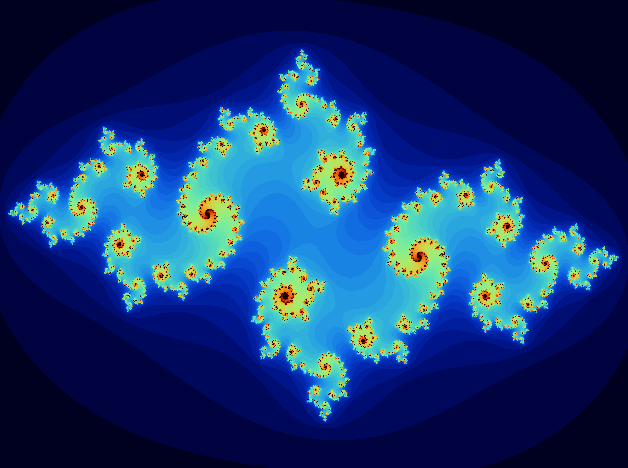

# Fractal

This repository contains the semestral project I completed for the course **PRG (Programming in C)** at the CTU (Czech Technical University).

## Project Description

### Overview

The goal of this semestral project was to develop a C multi-threaded application that calculates fractals, i.e., maps a dynamic system in part of the complex plane to a 2D image. Specifically, it involves the calculation of the Julia set.

### Key Objectives

- **Develop a Functional Application:** Create an application in C that performs specific tasks.
- **Implement Core Features:** Ensure the application includes all required features as outlined in the project description.
- **Demonstrate Programming Proficiency:** Utilize various C programming concepts and techniques effectively.

### Outcome

I developed an application that allows for the calculation of various fractals and even generates animations where the displayed fractals change due to continuously varying parameters.

